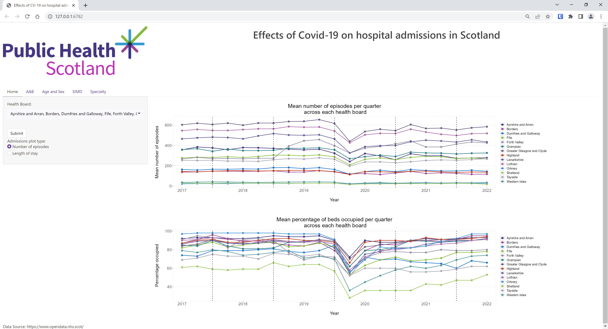
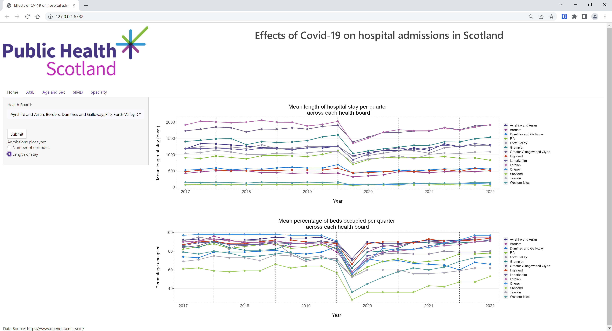
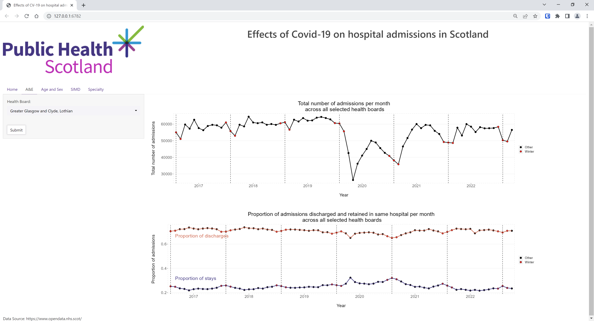
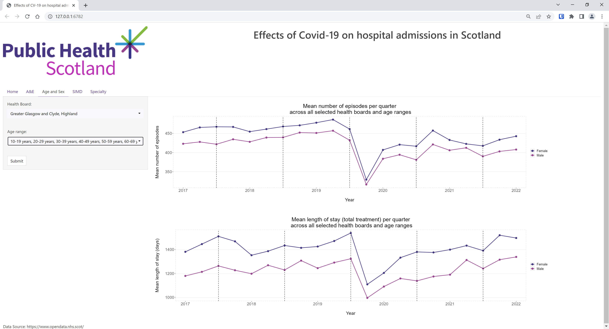
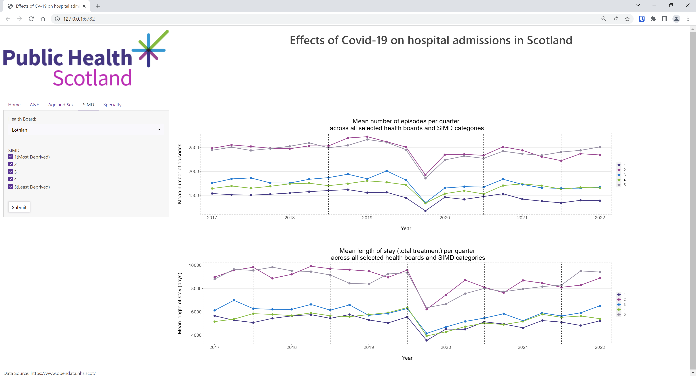
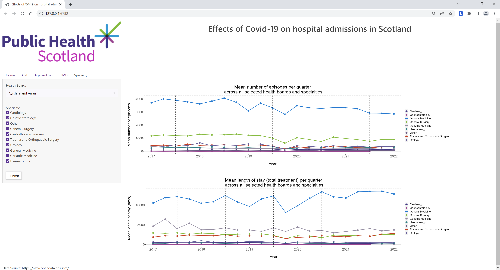

# **PHS Scotland Dashboard**

------------------------------------------------------------------------

## Project description

In this project, the effects of the Covid-19 pandemic on acute care in
Scotland were investigated using data obtained from Public Health
Scotland under Open Government Data license 3.0. This project also determines if the media reported "winter crises" exists.

The dashboard consists of patient admission numbers (A&E and inpatient), length of
stay and bed occupancy by Scottish health board. The data is separated
by age, sex, Scottish index of multiple deprivation and medical
specialty.

A&E is the first point of contact for most patients in secondary care,
and therefore an A&E dataset was used to answer the question about
winter crisis effect. As it provided monthly data rather than quarterly
data, December, January and February were specifically targeted for this
winter crisis analysis.

Inpatient datasets from 2017 to 2022 were used to answer the questions
about demographics and effects of Covid-19 on acute care across each
health board.

Further details of the project description are located within the
`planning` folder.

<br>

------------------------------------------------------------------------

## Group members and roles

**Mandip Farmahan**:

-   Exploratory analysis of Covid-19 data;
-   Designing and implementing the dashboard application.

**Sarah Henry**:

-   Exploratory analysis of patient demographics and deprivation data;
-   Statistical analysis of winter effect.

**Mark MacDonald**:

-   Exploratory analysis of A&E and bed occupancy data;
-   Integration of exploratory analysis with dashboard application.

**Vera Shcherbina**:

-   Exploratory analysis of speciality data;
-   Regulations and ethics.

**All**:

-   Project planning;
-   Dashboard application troubleshooting;
-   Presentation.

<br>

---

## PHS Datasets

The following datasets were obtained from www.opendata.nhs.scot for
analysis:

[Activity by Board of Treatment, Age and
Sex](https://www.opendata.nhs.scot/dataset/d73b93ab-b09f-4d39-9cfb-0e5e34085803/resource/00c00ecc-b533-426e-a433-42d79bdea5d4/download/inpatient_and_daycase_by_nhs_board_of_treatment_age_and_sex.csv)

[Activity by Board of Treatment and
Deprivation](https://www.opendata.nhs.scot/dataset/d73b93ab-b09f-4d39-9cfb-0e5e34085803/resource/4fc640aa-bdd4-4fbe-805b-1da1c8ed6383/download/inpatient_and_daycase_by_nhs_board_of_treatment_and_simd.csv)

[Activity by Board of Treatment and
Specialty](https://www.opendata.nhs.scot/dataset/d73b93ab-b09f-4d39-9cfb-0e5e34085803/resource/c3b4be64-5fb4-4a2f-af41-b0012f0a276a/download/inpatient_and_daycase_by_nhs_board_of_treatment_and_specialty.csv)

[Beds by Board of Treatment and
Specialty](https://www.opendata.nhs.scot/dataset/554b0e7a-ccac-4bb6-82db-1a8b306fcb36/resource/f272bb7d-5320-4491-84c1-614a2c064007/download/beds_by_nhs_board_of_treatment_and_specialty.csv)

[Health Board 2014 - Health Board
2019](https://www.opendata.nhs.scot/dataset/9f942fdb-e59e-44f5-b534-d6e17229cc7b/resource/652ff726-e676-4a20-abda-435b98dd7bdc/download/hb14_hb19.csv)

[Monthly Accident and Emergency Waiting
Times](https://www.opendata.nhs.scot/dataset/997acaa5-afe0-49d9-b333-dcf84584603d/resource/2a4adc0a-e8e3-4605-9ade-61e13a85b3b9/download/monthly_ae_waitingtimes_202303.csv)

<br>

------------------------------------------------------------------------

## Data cleaning

The data cleaning scripts are located in the `cleaning_scripts` folder.
The libraries required to run the data cleaning scripts are:

```         
library(here)
library(janitor)
library(tidyverse)
```

<br>

The following data cleaning tasks were carried out in all scripts:

-   Import the data from the CSV file;
-   Clean the column names;
-   Remove any special health boards;
-   Recode health board codes with name of health board area;
-   Replace any zeroes with NA in numerical columns;
-   Remove any non-essential columns;
-   Export clean data to CSV file.

<br>

------------------------------------------------------------------------

## Exploratory data analysis

The data analysis scripts are located in the
`analysis_scripts_and_reports` folder. The libraries required to run the
data analysis scripts are:

```         
library(here)
library(tidyverse)
```

The analysis contained within these files guided the final analysis
within `server.R` of the dashboard application.

<br>

------------------------------------------------------------------------

## Dashboard application

### Functionality

The dashboard application has five tabs:

#### 1. Home tab



<br>



<br>

#### 2. A&E tab



<br>

#### 3. Age/Sex tab



<br>

#### 4. Scottish Index of Multiple Deprivation (SIMD) tab



<br>

#### 5. Medical specialty tab



<br>

------------------------------------------------------------------------

## Statistical Analysis

The statistical analysis report investigating if the media reported
"winter crises" exists is located in the `analysis_scripts_and_reports`
folder. The main findings are:

-   Reduction in number of A&E admissions in winter compared to the rest
    of the year across the five year period.
-   Reduction in number of A&E admissions in winter compared to the rest
    of the year before Covid-19 and after Covid-19.
-   In summer more people were sent home, compared to winter when
    patients were more likely to be kept in hospital.

------------------------------------------------------------------------

## License

Distributed under the MIT License. See `LICENSE.txt` for more
information.
